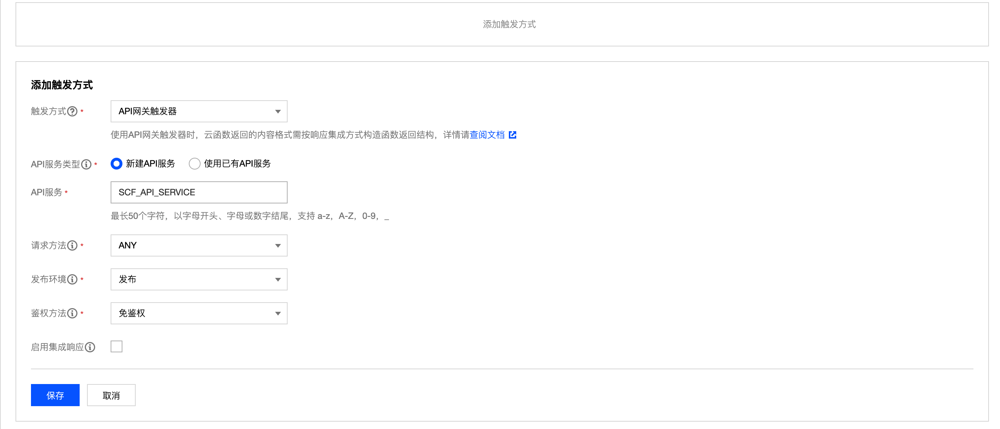
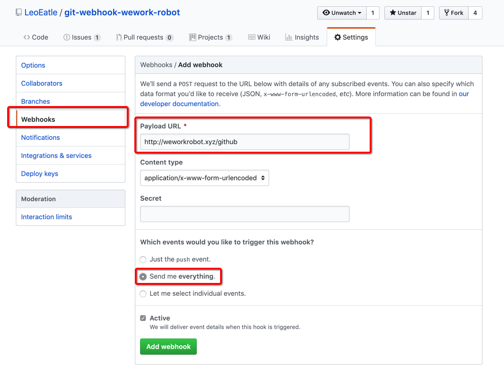

# 介绍
本项目是一个Fork自[LeoEatle/git-webhook-wework-robot](https://github.com/LeoEatle/git-webhook-wework-robot)的开源项目，用以在企业微信中使用机器人对github repo 的commit 和 pr 进行通知，在原repo的基础上根据项目需求进行了通知部分的更改。

# 使用方法

## 使用已经部署的域名

`https://service-kv5we7wu-1253186802.gz.apigw.tencentcs.com/release/WxBot_Github`

## 自建云函数部署方式：

1. `git clone https://github.com/lilith-avatar/git-webhook-wework-robot.git`
2. 注册并登陆腾讯云管理后台，新建一个云函数，可以先选个Node的Helloworld模板
3. 将代码中的`cloud`目录上传，见图


4. 点击保存（保存后🉑️测试试试）

5. 选择触发方式，添加新的触发方式，类型选择API网关，保存后得到url


6. ok!可以填到Github的webhook里了，类型选择`Send me everything`，也可以自定义，url填上上面的url，**别忘了要在后面加上`?id={你的机器人id}`作为参数**。

## Github设置：

在github项目中的`Setting`中选择`Webhooks`，选择`Add Webhooks`，填写url，,如果是使用已经部署过的域名，则为`https://service-kv5we7wu-1253186802.gz.apigw.tencentcs.com/release/WxBot_Github`。



# 目前支持的事件
## Push event 示例


## Issue event 示例


## Pull Request 示例


Merge Request 会有发起、合并、关闭、重新发起等几种情况，文案和颜色会有所不同。

# 项目介绍 && 开发（热烈欢迎提PR）

此项目用于连接git webhook和企业微信机器人webhook，采用koa2 + typescript开发，大部分git webhook 和 企业微信机器人的数据结构已经定义好typing，如：

```typescript
interface Repository {
    name: string;
    description: string;
    homepage: string;
    git_http_url: string;
    git_ssh_url: string;
    url: string;
    visibility_level: number;
}
```

并且项目有配置严格的tslint和lint-staged等检查。

异步解决方案为`async/await`

github事件handler: `github.ts`
gitlab事件handler: `gilab.ts`

chatRobot推送信息相关: `chat.ts`

## 提交

```bash
git add .
npm run commit # 让commitlint自动生成commit信息
```

## Contributors ✨

Thanks goes to these wonderful people ([emoji key](https://allcontributors.org/docs/en/emoji-key)):

<!-- ALL-CONTRIBUTORS-LIST:START - Do not remove or modify this section -->
<!-- prettier-ignore -->
<table>
  <tr>
    <td align="center"><a href="http://blog.soul11201.com"><br /><sub><b>soul11201</b></sub></a><br /><a href="https://github.com/LeoEatle/git-webhook-wework-robot/issues?q=author%3Anoname007" title="Bug reports">🐛</a> <a href="https://github.com/LeoEatle/git-webhook-wework-robot/commits?author=noname007" title="Code">💻</a></td>
    <td align="center"><a href="https://liubiantao.github.io"><br /><sub><b>Haitao</b></sub></a><br /><a href="https://github.com/LeoEatle/git-webhook-wework-robot/issues?q=author%3Aliubiantao" title="Bug reports">🐛</a> <a href="https://github.com/LeoEatle/git-webhook-wework-robot/commits?author=liubiantao" title="Code">💻</a></td>
  </tr>
</table>

<!-- ALL-CONTRIBUTORS-LIST:END -->

This project follows the [all-contributors](https://github.com/all-contributors/all-contributors) specification. Contributions of any kind welcome!
